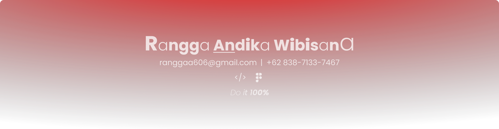

<h3>Hi 👋, I’m Rangga Andika Wibisana,</h3>

I am a Fresh Graduate Information Systems student at Bina Nusantara University also a passionate developer with a strong focus on building robust backend logic and clean, intuitive user interfaces. I believe that great software is born from the perfect harmony of efficient server-side architecture and accessible frontend design.
Currently, I am working as an Freelance Developer, where I actively use Next.js and TypeScript for frontend development, alongside Go (Gin framework) for building scalable APIs. I am always eager to learn new technologies and tackle complex problems.
Outside of coding I play musical instrument such as guitar, piano, bass, and drums to keep my sanity.

<h3 align="left">Connect with me</h3>

  
  
  
Check out my portfolio <a href="https://rangga-dev.my.id">here</a>

<h1 align="left">Stacks</h1>

<h3 align="left">Frontend</h3>

For frontend projects, I’m used to working with ReactJS using the Next.js framework and several Node.js libraries, including Ant Design (for components), Axios for API instance (interceptors, headers, types, etc.), and Tanstack and React-Query (for fetching, cache validation, and mutations). For styling, I use Tailwind more often than Bootstrap because I find Tailwind to be much more customizable than Bootstrap. For UI/UX design, I use Figma.

<h3 align="left">Backend</h3>

For my backend projects, I use two different tech stacks depending on the requirements. For performance-critical projects, I typically use the Go programming language (Golang), GORM (Go ORM), and PostgreSQL (database). However, for rapid development projects, I use the TypeScript programming language, Next.js’s built-in API Routes with Prisma (ORM), and PostgreSQL (database).

<h3 align="left">Tools & Utilities</h3>

There are several development kits or tools that I use as my primary development tools:
<ol>
<li>Visual Studio Code for code editor, terminal, file explorer (main IDE)</li>
<li>Git for version control</li>
<li>Node.js for the runtime engine</li>
<li>Node Package Manager (NPM) for the package manager and runtime controller</li>
<li>Postman or Apidog (since Postman sometimes has errors, I occasionally switch to Apidog) for tools for making API calls</li>
<li>DBeaver or Tableplus for a database management system</li>
</ol>

I'm currently very interested in learning mobile development stacks like Kotlin and Swift. If you'd like to invite me to study with you, hit me up via email or any platform you prefer.

